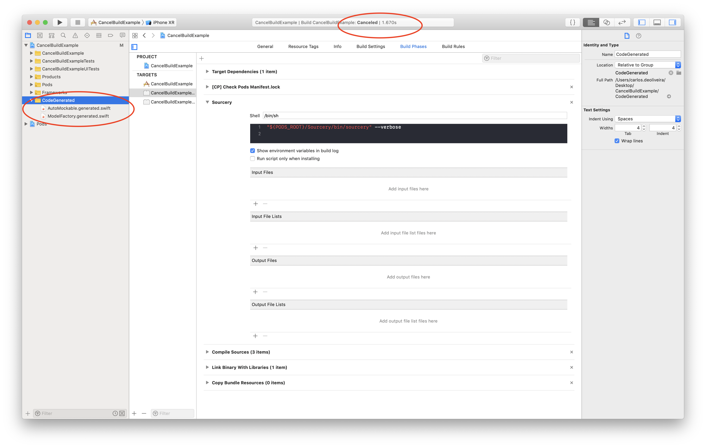

# Sample of XCode canceling builds when using sourcery

#### Steps to reproduce:
1. Bundle install
2. Pod install
3. Open XCode
4. Run Tests

#### Expeted:
Run the tests

#### Actual:
Build Canceled

#### Notes:
I was able to reproduce this for the vast majority of the cases, but it's still an intermittent behavior. 
So if you manage to run the tests please delete the `CodeGenerated` folder and generated files in it, then go to `step 4` one more time.